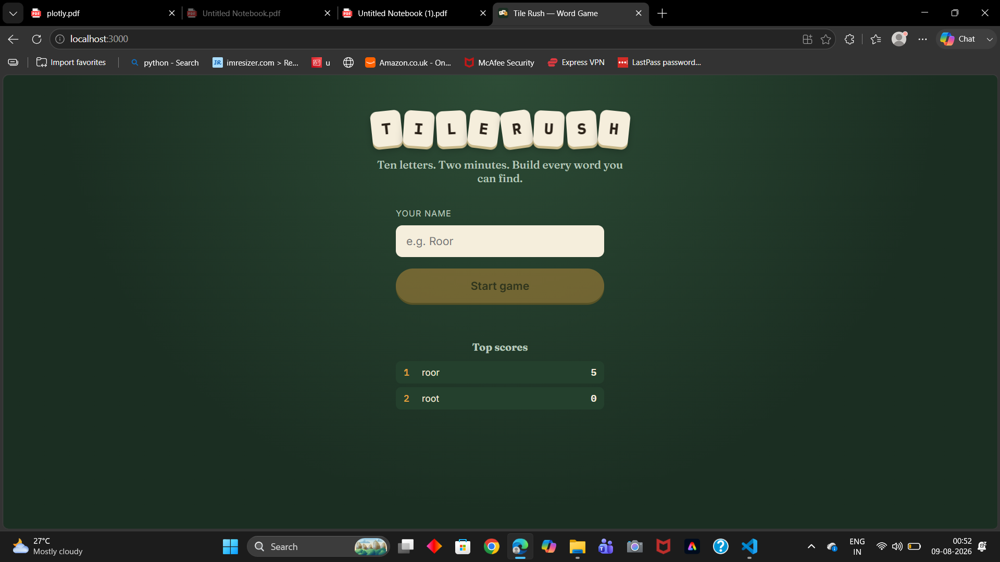

# Tile Rush — Word Game

A word-building game: 10 letter tiles, 2 minutes, find as many valid words
as you can. React frontend + Express/SQLite backend.



```
wordgame/
├── backend/     Express API (games, scoring, dictionary, leaderboard)
└── frontend/    React app (the redesigned "Tile Rush" UI)
```


**Backend**
- Dictionary went from 6 hardcoded words to a real ~248,000-word English
  dictionary, loaded into memory for instant lookups (`db/words.json` +
  `db/dictionary.js`).
- Database switched from `:memory:` to a file (`db/wordgame.db`), so games
  and scores survive a server restart.
- Added a real 2-minute game timer, duplicate-word rejection, letter-pool
  validation, and a `/api/leaderboard` endpoint.
- Letter generation now uses Scrabble-style weighted frequencies with a
  min/max vowel guardrail (3–5 vowels per board) instead of pure uniform
  randomness, so boards stay playable.
- All error responses are JSON now (the original returned raw strings,
  which is awkward to handle in the frontend).
- Removed the unused empty model files (`gameModel.js`, `wordModel.js`,
  `dictionaryModel.js`) and the `body-parser` dependency (Express's
  built-in `express.json()` replaces it).

**Frontend**
- Full redesign: tactile letter tiles, tap-to-build word tray, live
  countdown timer, found-words list, a proper name-entry screen (no more
  `window.prompt`), and a results screen.
- Error handling fixed (`err.response.data` could crash if the request
  failed before a response came back).
- API base URL is now configurable via `REACT_APP_API_URL` for production
  builds instead of being hardcoded to `localhost`.

## Running it locally

**Backend**
```bash
cd backend
npm install
npm start
```
Runs on `http://localhost:8000`. First boot loads the dictionary (~250k
words) into memory — that's normal and only takes a second.

**Frontend**
```bash
cd frontend
npm install
npm start
```
Runs on `http://localhost:3000` and talks to the backend automatically.

To run the frontend's test suite: `npm test` (inside `frontend/`).

## Deploying so a mobile build can reach it

Google Play won't let your app talk to `localhost`, so before wrapping
the frontend for mobile you need the backend hosted somewhere reachable
over the internet (Render, Railway, Fly.io, a VPS, etc. all work fine
for a small Express + SQLite app).

Once it's deployed, point the frontend at it:
```bash
cd frontend
cp .env.example .env
# edit .env: REACT_APP_API_URL=https://your-backend-domain.com/api
npm run build
```

## Getting this onto the Google Play Store

This is a React **web app**, not a native or React Native app — Play
Store submissions need an Android package (`.aab`/`.apk`), so there's one
more step beyond copy-pasting code. The most common path:

1. **Deploy the backend** (see above) so it's reachable from the internet.
2. **Build the frontend** (`npm run build` with `REACT_APP_API_URL` set).
3. **Wrap it with [Capacitor](https://capacitorjs.com/)**, which packages
   a web build into a real Android app shell:
   ```bash
   cd frontend
   npm install @capacitor/core @capacitor/android
   npx cap init "Tile Rush" "com.yourname.tilerush" --web-dir=build
   npx cap add android
   npx cap copy
   npx cap open android
   ```
 
4. **Create a Google Play Developer account** ($25 one-time fee), then
   create a new app in the [Play Console](https://play.google.com/console)
   and upload the signed `.aab`, along with a store listing (screenshots,
   description, icon, privacy policy URL — required even for simple apps).


